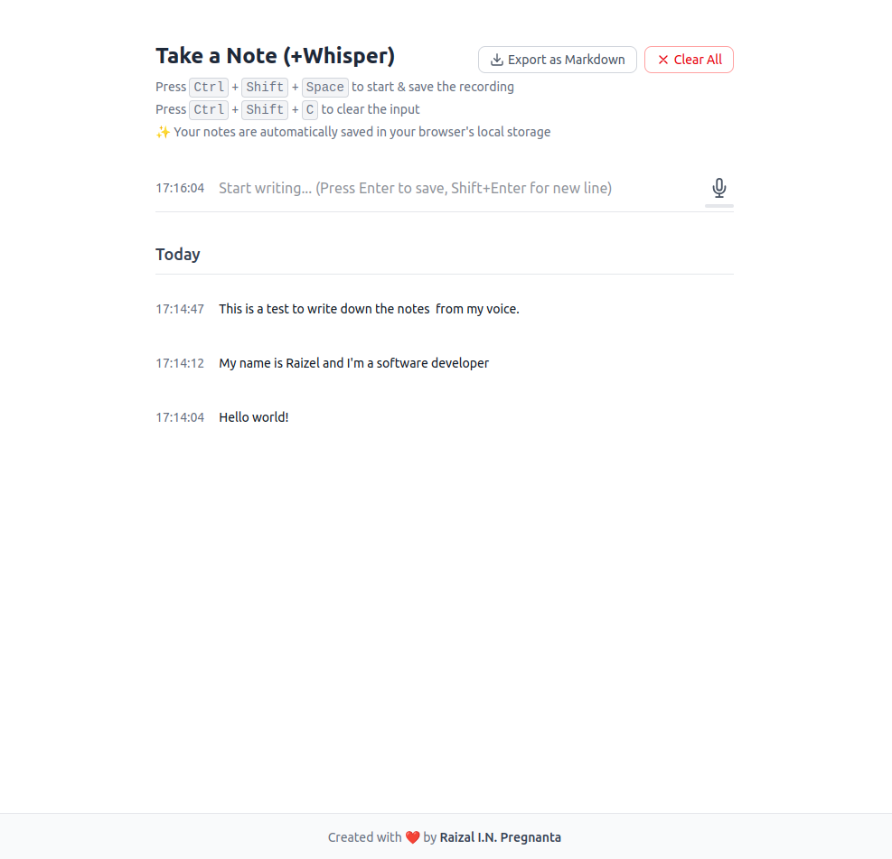

# Voice to Note Web App

A real-time voice transcription application that converts your speech to text notes.




## Features

- Record voice with real-time transcription using Groq API
- Automatic silence detection (stops recording after 1 second of silence)
- Save transcribed notes
- View all your saved notes

## Tech Stack

- **Frontend**: Svelte with TypeScript
- **Backend**: Express.js
- **Real-time Communication**: Socket.IO
- **Speech-to-Text**: Groq API with OpenAI client

## Project Structure

```
voice-to-note/
├── client/             # Svelte frontend
├── server/             # Express backend
└── README.md           # This file
```

## Getting Started

### Prerequisites

- Node.js (v18 or later recommended)
- pnpm package manager
- Groq API key (for speech-to-text functionality)

### API Keys Setup

1. Sign up for a Groq account at [https://console.groq.com/](https://console.groq.com/)
2. Generate an API key from the Groq console
3. Create a `.env` file in the `server` directory based on the `.env.example` template
4. Add your Groq API key to the `.env` file:
   ```
   GROQ_API_KEY=your_groq_api_key_here
   ```

### Testing the Transcription Service

Before running the full application, you can test if your Groq API integration is working correctly:

1. Place a test audio file named `test-audio.webm` in the server directory
2. Run the test script:
   ```bash
   cd server
   pnpm run test-transcription
   ```
3. If successful, you should see the transcribed text from your audio file
4. If you get an error, check that your API key is correctly set in the `.env` file

### Installation

1. Clone the repository
2. Install dependencies:

```bash
# Install server dependencies
cd server
pnpm install

# Install client dependencies
cd ../client
pnpm install
```

### Development

1. Start the backend server:

```bash
cd server
pnpm run dev
```

2. In a separate terminal, start the frontend:

```bash
cd client
pnpm run dev
```

3. Open your browser and navigate to `http://localhost:5173`

### Production Build

1. Build the client:

```bash
cd client
pnpm run build
```

2. Build the server:

```bash
cd server
pnpm run build
```

3. Start the production server:

```bash
cd server
pnpm start
```

The server will serve the static files from the client's build directory.

## Usage

1. Click "Start Recording" to begin recording your voice
2. Speak clearly into your microphone
3. The app will transcribe your speech in real-time using Groq's Speech-to-Text API
4. When you pause for 1 second, recording will automatically stop
5. The transcribed note will be saved and displayed in the notes list

## Notes about Speech-to-Text

This application uses Groq's API with the OpenAI client for real-time speech-to-text transcription. The integration follows Groq's documentation and uses the Whisper large v3 model for high-quality transcription.

```javascript
// Example of Groq API integration for transcription
const openai = new OpenAI({
  apiKey: config.groqApiKey,
  baseURL: 'https://api.groq.com/openai/v1',
});

// Use the OpenAI API for transcription
const response = await openai.audio.transcriptions.create({
  file: audioFile,
  model: "whisper-large-v3",
});
```

For optimal transcription quality:
- Speak clearly with minimal background noise
- Audio is processed in chunks for real-time feedback
- Longer recordings may have higher accuracy

## Troubleshooting

- **Audio Permission Issues**: Make sure your browser has permission to access your microphone
- **Transcription Errors**: Check your Groq API key and ensure it has sufficient quota
- **"Invalid API Key" Error**: Verify your API key is correctly set in the `.env` file
- **Silent Recording**: Check that your microphone is working and not muted

## License

ISC 